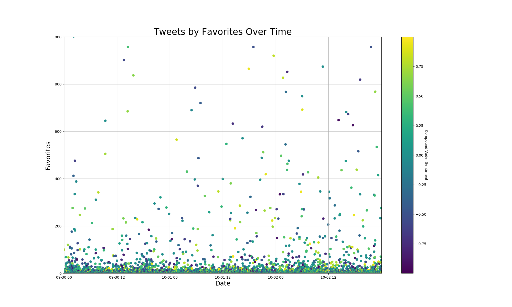
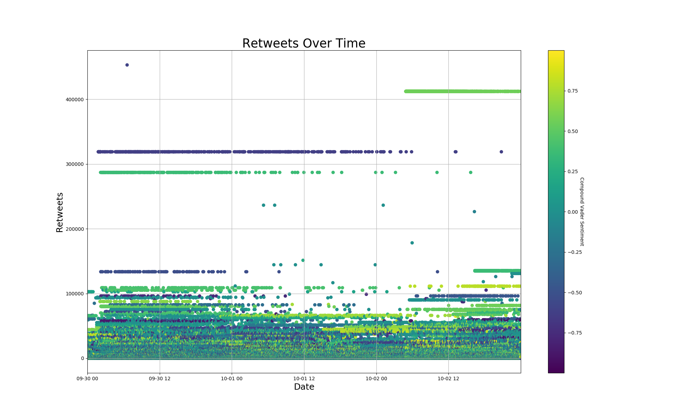
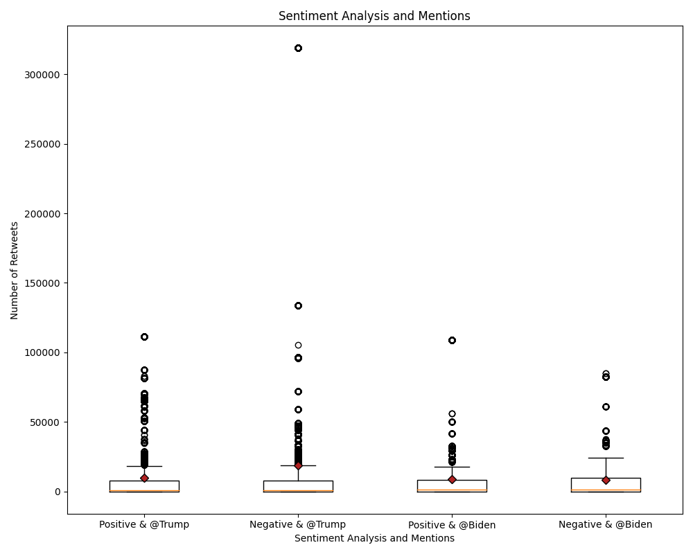
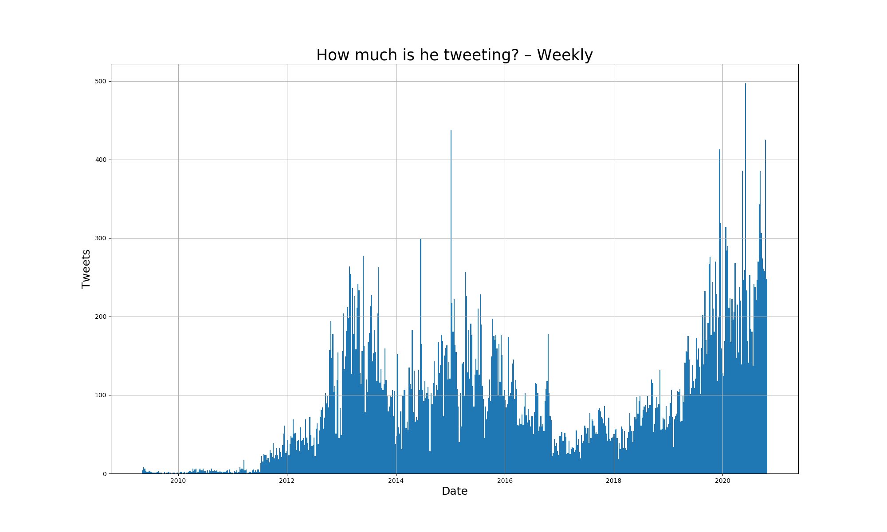
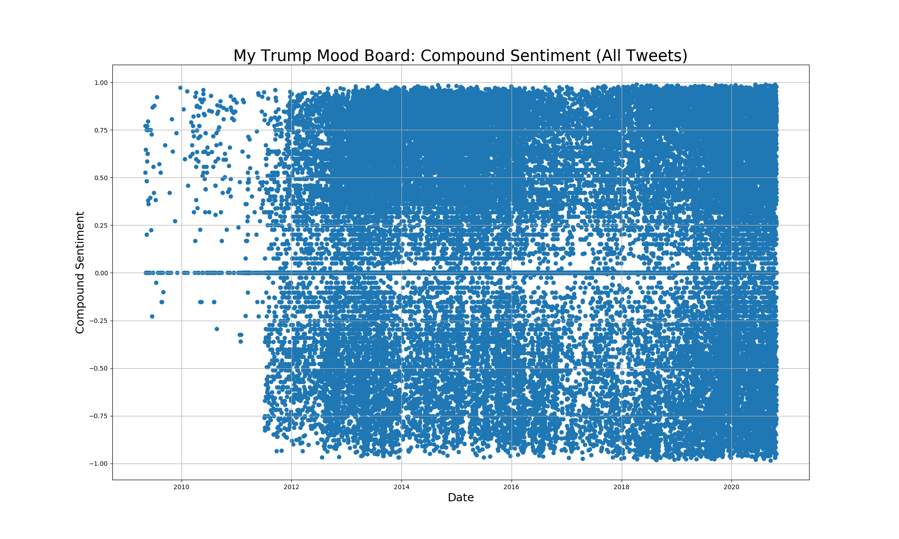
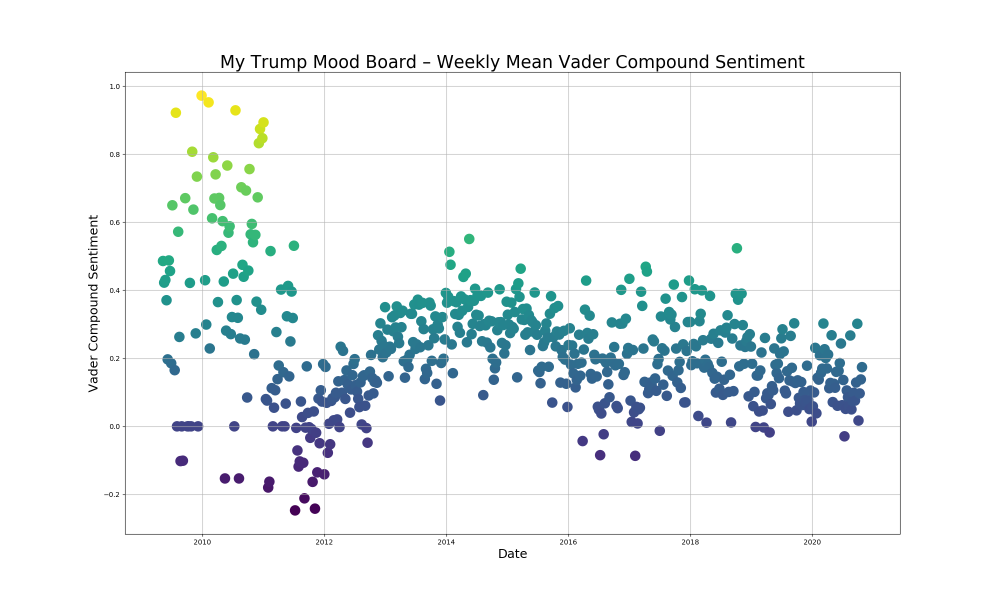
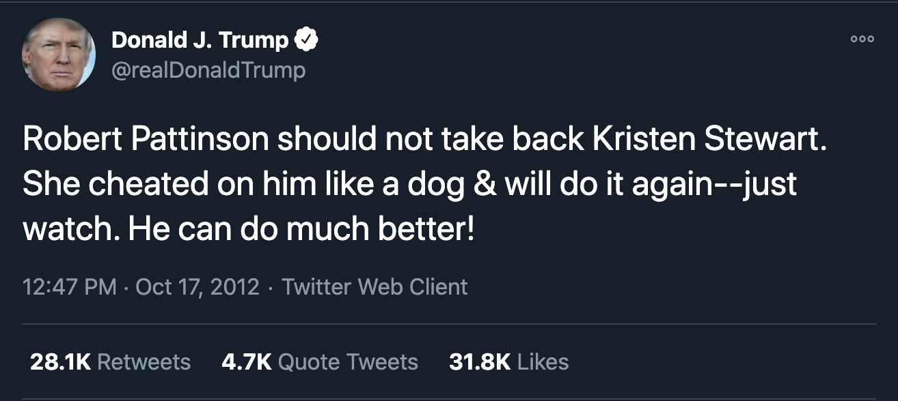
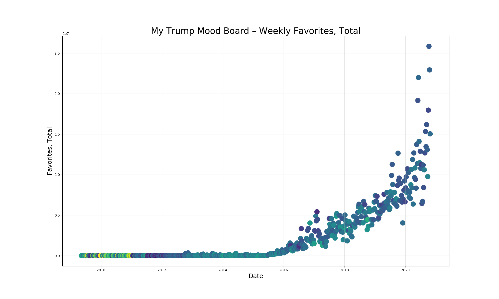
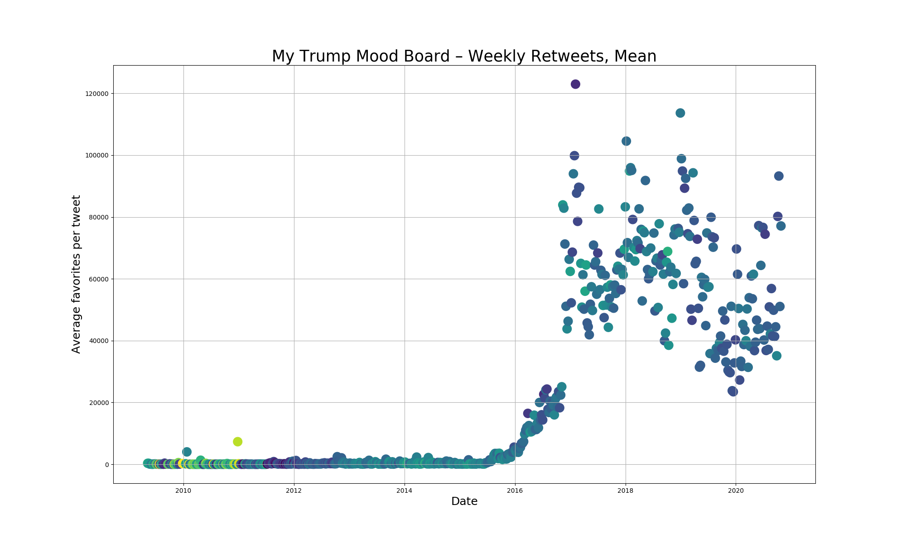

Team: Jeff Bauerle, Taylor Britt, Anna Hanson

# Natural Language Processing Categorization and Vader Sentiment Analysis of Political Tweets

## The Data

The original dataset is a JSONL file which is collection of 140337 tweets from highly political accounts spanning September 30 to October 2 2020, a time period which began right after the first presidential debate between Biden and Trump. The dataset includes information on the time the tweet was posted, the text of the tweet, a count of retweets, favorites, hashtags, and information on the profile of the poster, including the twitter handle, screen name, and profile description.

We also downloaded an archive of all of Donald Trump's tweets, 54,753 tweets spanning from May 4th 2009 to present (this includes tweets that have been deleted since 2016, but not before.)

## Feature Engineering and VADER

We loaded the datasets into Pandas DataFrames to explore them and create some new features. We parsed the text of the tweets to create dummy variables for tweets that mentioned Trump, Biden, Clinton, Obama, and Bush, although we only ended up using the first two. We also creaated a dummy variable for accounts that ended with at least 5 trailing numbers because we thought it might be a telltale sign of a bot, but wound up not having time to pursue this line of inquiry. 

We also used VADER Sentiment Analysis on the text of each tweet, which yielded a score for the negativity, positivity, neutrality and compound sentiment score for each tweet. This wound up being the basis for the statistical test that we conducted.

Lastly, we used NLP to categorize the corpus of tweets into topics.

## EDA

We initially hypothesized that there might be some interesting patterns related to the time that tweets were posted and how many favorites they yielded. As indicated on the side, this scatter plot is color coded to compound sentiment analysis: tweets with scores near 1 (most positive) are green, scores near 0 (neutral) are green, and near -1 (most negative) are purple. There did not appear to be a clear pattern here, but we were curious if trends might emerge when we looked more specifically at engagement in conjunction with the mention of Trump or Biden in the tweet.

Likewise, retweets did not seem to show a particular pattern with regards to sentiment and time posted. However, notice the interesting horizontal streaking pattern as tweets are reposted over and over again through retweeting. 

## Statistical Analysis of Retweet count by candidate mention and compound sentiment analysis score.

We visualized the four categories in a box plot initially to see if the data was normally distributed and if we could see any differences between the groups right off the bat.
Our four groups were:
<ul>
    <li>Positive Sentiment & Trump Mention (+T)</li>
    <li>Negative Sentiment & Trump Mention (-T)</li>
    <li>Positive Sentiment & Biden Mention (+B)</li>
    <li>Negative Sentiment & Biden Mention (-B)</li>
</ul>

From this, we observed the data was not a normal distribution and that there seemed to be differences between the groups.

Our alpha originally was set to 0.05 and we used a Bonferroni correction at the very end of our tests to adjust our alphas and p-values for each test. Our corrected alpha was 0.0071. For each test, the null hypothesis was that there was no difference between the groups.

In order to check for a statistical significance between the four groups while accounting for the high variance and the non normal distribution, we used the Kruskal-Wallis Test. This returns an F-statistic and a p-value. Our adjusted p-value was 4.6e-109 which lead us to reject our null hypothesis. There was a statistical significance between the four categories of tweets.

Next we performed six Mann-Whitney U tests to compare each of the groups individually. We choose the Mann-Whitney U test again due to the non-normal distribution and high variance.
<ul>
    <li>+T compared to -T. Corrected p-value: 1. Fail to reject null hypothesis</li>
    <li>+B compared to -B. Corrected p-value: 1. Fail to reject null hypothesis</li>
    <li>+T compared to +B. Corrected p-value: 1.2e-8. Reject null hypothesis</li>
    <li>-T compared to -B. Corrected p-value: 2.3e-10. Reject null hypothesis</li>
    <li>+T compared to -B. Corrected p-value: 1e-11. Reject null hypothesis</li>
    <li>-T compared to +B. Corrected p-value: 2e-7. Reject null hypothesis</li>
</ul>

When comparing the the retweet counts for the positive to negative sentiments for each candidate mentioned, there was no statistical difference in positive vs the negative for the same candidate. However, each time the different candidates were compared, there was a statistical difference.

### Disclaimers and Inferences:

We were operating under the assumption that a tweet which only mentioned Biden and had a positive compound VADER sentiment would probably be favorable towards Biden, but unfortunately looking at the profiles of the accounts associated with these tweets proved that this assumption was unfounded. Here's a selection of the profile descriptions from the first five rows of the dataframe:

>"Proud American! Happily married! Pro#God,Family,Country, Life,Israel,Gun's,Police,Active Military,All Vet's,(but not Bergdahl,)American Made! #MAGA #KAG", (Muzzo11Sb)

>"⛩2Ꮮive in the 2Ten⛩ I just have good eyes and hands that abide. Artist. I draw what I like. Currently that includes nudes and patriots. #deplorable #intactivist" (DeuceDimes)

>'Love life and everything it has to offer. I consider myself a leader not a follower. Seeking truth and justice. Always striving to be better. WWG1WGA 🇺🇸🇺🇸' (SandyTRUMP2020)

Effectively, while the statistical differene remains valid, we can't infer that positive-sentiment tweets that mention Biden or Trump are necessarily pro-Biden – imagine, for instance, a tweet that read something like "I'm so very happy that Joe Biden is about to go to jail!"

## NLP 

Performed standard NLP pipeline:
- lowercased words
- removed punctuation
- lemmatized words

Topics found via LDA:

Topic #1 (covid personally affecting Trump): 
will flotus tonight positive covid19 tested recovery wallace white immediately

Topic #2 (taxes):
want time ballot year say tax new one donald amp

Topic #3 (biden):
thank will everyone negative happy report time jill covid tested

Topic #4 (white supremacy):
white state america stand supremacist vote united last night say

Topic #5 (covid affecting Americans):
people covid american know mask amp will first hope got

## pyLDAvis
https://datathon-oct30.s3-us-west-2.amazonaws.com/ldavis_prepared_5.html#topic=0&lambda=1&term=

## Trump Twitter Archive

Lastly, we also applied Vader analysis to a collection of all of Donald Trump's tweets, and looked at general patterns in his tweeting habits since he began a decade ago. We also looked at how his frequency of tweeting and engagement (likes and retweets) has changed over time. 

When looking at weekly tweet frequency, we can see that there is a sudden increase in tweets beginning in mid-2011. 

Interestingly, despite Trump's status as a notoriously 'online' president, his tweeting frequency declined fairly sharply in the early years of his presidency. However, the final this pattern has not held, and 2020 clearly 

The change in mid-2011 is starker when we look at the look at Vader Compound sentiment: the vast majority of the tweets prior to this are rated as positive, but then suddenly begin to fill out the emotional spectrum. 

This is even clearer when we look at the weekly mean compound sentiment: one might be tempted to conclude that this is evidence that Trump's increasingly heavy twitter use made him upset, but a more likely explanation is that he actually began using the service himself at this time, rather than delegating to an assistant (17 out of his first 20 tweets feature links to tinyurl, his facebook page, or the now defunct website trumpthinklikeachampion.com)

Below is an example of his early twitter presence after the sudden change in sentiment: in contrast to his earliest tweets, it seems highly unlikely that an an assistant would have composed something like this:

Turning to his engagement on twitter, the sum total of likes that Trump's tweets accrue per week begins a sudden growth in 2015 (likely coinciding with the beginning of his formal political campaign) that now appears to be skyrocketing towards a sort of infinite and all consuming level of attention. (Looking at retweets revealed a very similar pattern.)

However, when we instead look at mean weekly favorites per tweet rather than the sum total, a starker picture is evident. The average favorites per tweet suddenly explodes in late 2016, clearly coinciding with his shocking victory over Clinton in the election and ascension to the presidency. Yet, the subsequent pattern, if anything, follows a downward trajectory, evincing the decreasing marginal returns yielded by his more recent increased tweeting. Is the social media attention economy one of the worst deals of all time?

## Future Research

There are a number of interesting avenues that we could pursue. One area is the detection of automated "bot" accounts that are deployed to intentionally influence political discourse. Researchers at Indiana University have created a tool called ["Botometer"](https://botometer.osome.iu.edu/) that uses "over a thousand features to characterize the account's profile, friends, social network structure, temporal activity patterns, language, and sentiment." It would be interesting to compare how ostensible bots and real posters compare in tweeting habits.

Additionally, it would be interesting to apply NLP and other unsupervised learning techniques to the corpus of Trump's tweets to see if interesting topical patterns emerge. Finally, we curious as to whether there is a correlation between the general sentiment of Trump's tweets and that of political twitter at large – do pronouncements filled with joy or rage echo through the internet and color the tone of everyone around him. In the same vein, <i>many are saying</i> that Trump's particular style of writing has begun to pervade our general consciousness – it would be extremely interesting to conduct an analysis which evaluates whether the corpus of Trump's tweets and those of twitter at large (or certain relevant segments) have grown topically and stylistically closer together over time. 

## References:

### Political Twitter Data from September 30 to October 2:

Data Source: [GitHub Repo link provided @12PM Friday 10/29/2020]
<ol>
<li>Clone [GitHub Repo link provided @12PM Friday 10/29/2020]</li>
<li>Follow the instructions in the repository to install twarc and tqdm.</li>
<li>Apply for a twitter developer account.</li>
<li>Save api key, save api secret key, save bearer token.</li>
<li>Enter your twitter api information into twarc.</li>
<li>Use a mv command to move the contents of the desired days into a new single directory.</li>
<li>Look inside the cloned repository for the appropriate .txt files containing tweet ids. (ex. cat * >> file name.txt)</li>
<li>Concatenate those files into one file.</li>
<li>In the terminal, use awk 'NR % 100 == 0' <file.txt> > <result.txt> to systematically sample every 100th tweet id. These are the tweets you will hydrate.</li>
<li>Modify the hydrate.py script in the cloned repository and run the script to rehydrate tweets from your file of tweet ids.</li>
<li>Analyze tweets.</li>
</ol>

### Trump Twitter Archive
https://www.thetrumparchive.com/ 

### Vader Sentiment Analysis
https://github.com/cjhutto/vaderSentiment

### Topic Modeling in Python: Latent Dirichlet Allocation (LDA)
https://towardsdatascience.com/end-to-end-topic-modeling-in-python-latent-dirichlet-allocation-lda-35ce4ed6b3e0

